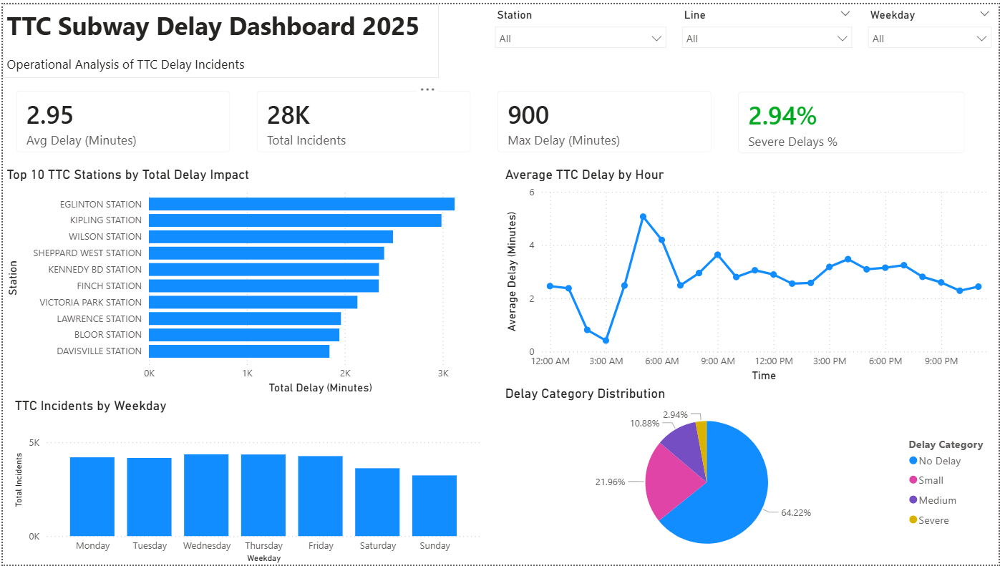
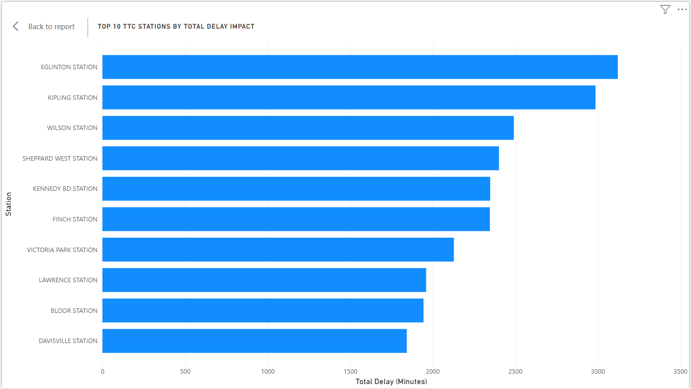
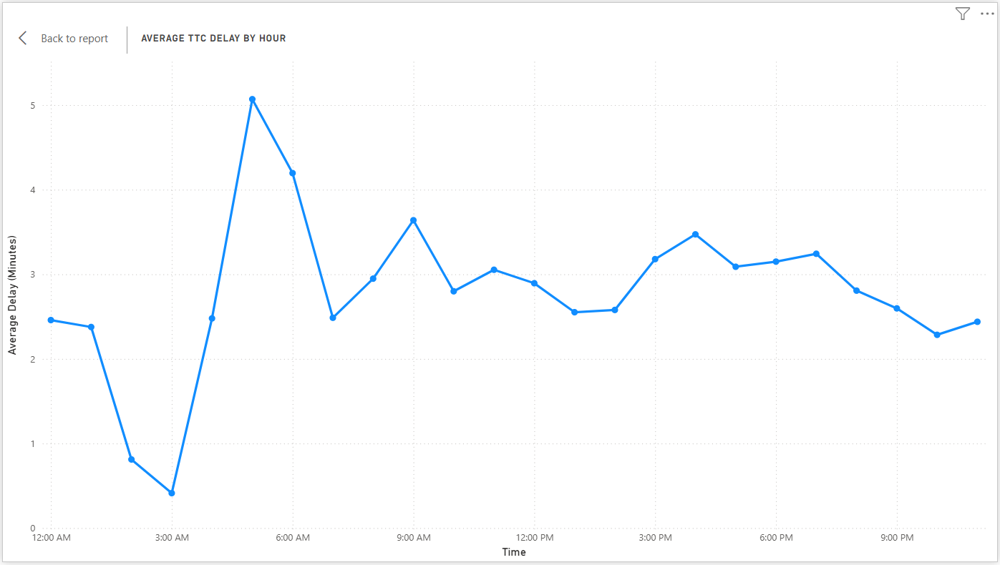

# TTC Subway Delay Analysis Dashboard

Python + Power BI project analyzing TTC subway delay patterns, station performance, and operational trends in Toronto’s transit system.

---

## Overview

This project analyzes TTC subway delay data to identify patterns in transit performance, including:
- peak delay periods
- high-impact stations
- delay severity distribution
- hourly and weekday trends

The dataset was cleaned and transformed using Python, then visualized in Power BI to create an interactive dashboard.

---

## Tools Used

- Python (pandas)
- Power BI
- Power Query
- CSV data processing

---

## Data Processing

The raw TTC dataset was cleaned using Python:
- handled missing values
- standardized data types
- created a unified DateTime field
- extracted Year, Month, Hour, and Weekday
- categorized delays into severity levels

---

## Data Insights

- Morning rush hour periods show the highest average delays
- A small number of stations account for a large share of total delay time
- Severe delays represent a low percentage of total incidents
- Delay patterns vary significantly by hour and weekday

---

## Dashboard Preview

### Full Dashboard


### Top Stations by Delay


### Average Delay by Hour


---

## Project Structure

```text
ttc-delay-dashboard/
│
├── data/
│   ├── ttc_subway_delay.csv
│   └── ttc_cleaned.csv
│
├── scripts/
│   └── clean_ttc_data.py
│
├── dashboard/
│   └── TTC_Delay_Dashboard.pbix
│
├── images/
│   ├── dashboard_overview.png
│   ├── top_stations.png
│   └── delay_by_hour.png
│
└── README.md
```
---

##  How to Run

### 1. Clone the repository
```bash
git clone https://github.com/sarahmasrie/ttc-delay-dashboard.git
```
### 2. Install dependencies
```bash
pip install pandas
```
### 3. Run the data cleaning script
```bash
python scripts/clean_ttc_data.py
```
### 4. Open the Power BI dashboard
```text
Navigate to: dashboard/TTC_Delay_Dashboard.pbix
```
---
## Author

**Sarah Masrie**  
Computer Programming Graduate  
Data Analytics & Business Intelligence Project
